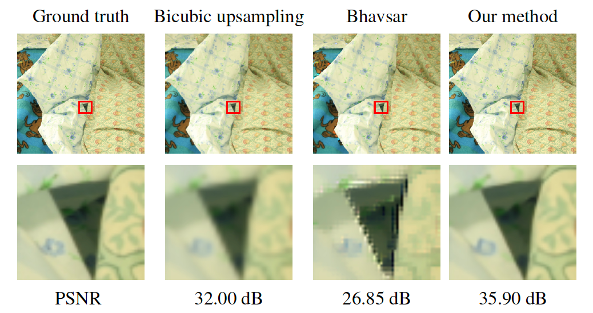

# Enhancing the Spatial Resolution of Stereo Images using a Parallax Prior


## General Information
- Codename: StereoSR (CVPR 2018)
- Writers:  Daniel S. Jeon (sjjeon@vclab.kaist.ac.kr), 	Seung-Hwan Baek (shwbaek@vclab.kaist.ac.kr), Inchang Choi (inchangchoi@vclab.kaist.ac.kr), Min H. Kim (minhkim@vclab.kaist.ac.kr)
- Institute: KAIST Visual Computing Laboratory

For information please see the paper ([**paper website link**](http://vclab.kaist.ac.kr/cvpr2018/)):
 - Enhancing the Spatial Resolution of Stereo Images using a Parallax Prior
   [**CVPR 2018**](http://cvpr2018.thecvf.com/), Daniel S. Jeon, Seung-Hwan Baek, Inchang Choi, Min H. Kim

Please cite our paper if you use any of the free material in this website:
- Bibtex:
```
@InProceedings{Jeonetal:CVPR:2018,
  author  = {Daniel S. Jeon and Seung-Hwan Baek and Inchang Choi
            and Min H. Kim},
  title   = {Enhancing the Spatial Resolution of Stereo Images
            using a Parallax Prior},
  booktitle = {Proc. IEEE Computer Vision and Pattern Recognition
            (CVPR 2018)},
  publisher = {IEEE},  
  address = {Salt Lake City, Utah, United States},
  year = {2018},
  pages = {},
  volume  = {},
}    
```

## License Information

- Daniel S. Jeon, Seung-Hwan Baek, Inchang Choi, Min H. Kim have developed this software and related documentation (the "Software"); confidential use in source form of the Software, without modification, is permitted provided that the following conditions are met:
  1. Neither the name of the copyright holder nor the names of any contributors may be used to endorse or promote products derived from the Software without specific prior written permission.
  2. The use of the software is for Non-Commercial Purposes only. As used in this Agreement, "Non-Commercial Purpose" means for the purpose of education or research in a non-commercial organisation only. "Non-Commercial Purpose" excludes, without limitation, any use of the Software for, as part of, or in any way in connection with a product (including software) or service which is sold, offered for sale, licensed, leased, published, loaned or rented. If you require a license for a use excluded by this agreement, please email [minhkim@kaist.ac.kr].

- License:  GNU General Public License Usage
Alternatively, this file may be used under the terms of the GNU General Public License version 3.0 as published by the Free Software Foundation and appearing in the file LICENSE.GPL included in the packaging of this file. Please review the following information to ensure the GNU General Public License version 3.0 requirements will be met: http://www.gnu.org/copyleft/gpl.html.

- Warranty: KAIST-VCLAB MAKES NO REPRESENTATIONS OR WARRANTIES ABOUT THE SUITABILITY OF THE SOFTWARE, EITHER EXPRESS OR IMPLIED, INCLUDING BUT NOT LIMITED TO THE IMPLIED WARRANTIES OF MERCHANTABILITY, FITNESS FOR A PARTICULAR PURPOSE, OR NON-INFRINGEMENT. KAIST-VCLAB SHALL NOT BE LIABLE FOR ANY DAMAGES SUFFERED BY LICENSEE AS A RESULT OF USING, MODIFYING OR DISTRIBUTING THIS SOFTWARE OR ITS DERIVATIVES.

## Requirements
We developed the codes on **Ubuntu 14.04** (which was explicitly tested) but believe that our codes could be executed on other platforms of Ubuntu, Windows, and OSX as well. When using different versions of Python and Tensorflow, minor modifications, such as function names, in the codes would be necessary.
* Python 3.6
* Tensorflow 1.10
* numpy
* scipy
* scikit-image
* matplotlib
* opencv-python
* pillow
* h5py

## How to Execute Demo
We have written a demo code in `demo_predict.py`.
```console
python demo_predict.py
```
You can change the scale parameter in demo_predict.py file. You also need to change model name corresponding to the scale. There are 2x, 3x and 4x models.

## Training data
We trained our network with [five middlebury stereo datasets](http://vision.middlebury.edu/stereo/data/) except cloth2, motorcycle, piano, pipes, sword2, which are used for test.

## Contacts
For questions, please send an email to **sjjeon@vclab.kaist.ac.kr**
